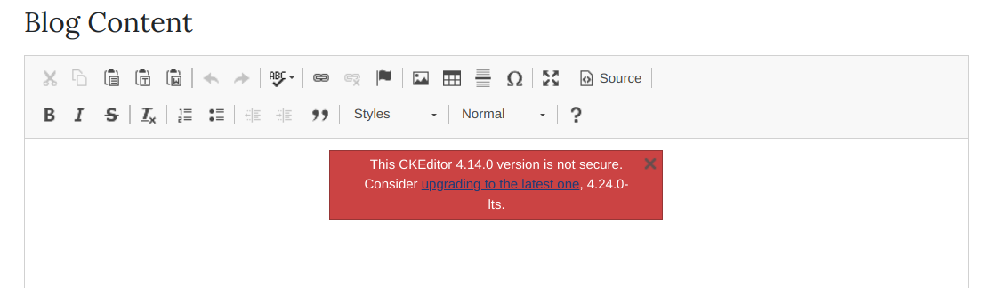

# Overview

This is day 67 assignment.

Today, we'll update our blog project.

We start with files supplied to us in the `start` folder.

 
# Running

# External Links

- https://flask-ckeditor.readthedocs.io/en/latest/basic.html
- https://bootstrap-flask.readthedocs.io/en/stable/macros/#render-form
- https://flask-wtf.readthedocs.io/en/stable/
- https://ckeditor.com/ckeditor-4/ : this comes up when we render our New Blog post screen

# requirements.txt

# Final Solution

# TODOs

