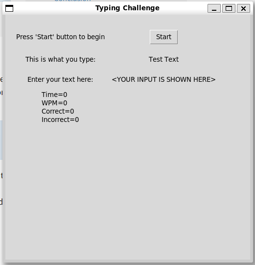

# Overview

This is the day 86 assignment.

## _From the course:_

A Tkinter GUI desktop application that tests your typing speed.

## My comments:

- See my activities for Days 27, 28, 29, 30, 31, 34

For this application, I'm intending to display an application with a few screen elements.
- Text that states, "press the button to begin"
- Button that says either "Start" or "Stop"
- A text box with the words we're meant to type in.
- A text box with the words we typed in.
- A running counter of
    - Chars typed in
    - Words tyed in
    - Time
    - WPM
    - Errors


I have to create a WPM metric, or look it up.  I'm thinking of using an open-source list of words, perhaps 1000 word.  The "Start" button shows me about 15 of these words, which I'll need to type.  The formula may be a simple as

```
(number of characters typed correctly - number of characters tped incorrectly) (60)
------------------------------------------------------------------------------------
(# characters in a word, perhaps 6) (number of elapsed seconds)
```


# Running

```bash
python3 day86.py
```
You have a simple window that shows:
- Instructions to press a start button
- The text you are meant to type in.
- The text you typed in.
- Realtime stats as you type.



The application is fairly simple.  You type and correct with `backspace` to match what you see.  This includes the `Enter` key to advance a new line.  Errors are fairly basic - either the string matches or it does not and the program matches one letter at a time.  This matches perfectly:

```
THis is sample T ext
THis is sample T ext
```

This only matches until the word "cat" and everything else is a non-match

```
I have two dogs and a cat and an elephant
I have two dogs and a cats and an elephant
```

The forumla for WPM is simple and shown below (see the code for the latest)

```python
            self.wpm = (self.correct_words + self.incorrect_words) / self.elapsed_seconds * 60
```
A word is matched on a space.


# External Links
- [TKinter docs for handling key events.](https://tkinterexamples.com/events/keyboard/)

# requirements.txt

- [Wonderwords to generate a list of words and sentences](https://pypi.org/project/wonderwords/)

# Final Solution

# TODOs
