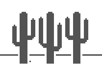

# Overview

This is the day 94 assignment.

## _From the course:_
Write Python code to play the Google Dinosaur Game.

On Chrome, when you try to access a website and your internet is down, you see a little dinosaur. (Apparently because dinosaurs have short arms and they "can't reach" your website.

On this page, there is a hidden game, if you hit space bar you can play the T-rex run game.

Alternatively you can access the game directly here:
https://elgoog.im/t-rex/

You goal today is to write a Python script to automate the playing of this game. Your program will look at the pixels on the screen to determine when it needs to hit the space bar and play the game automatically.

You can see what it looks like when the game is automated with a bot:
https://elgoog.im/t-rex/?bot


You might want to look up these two packages:

https://pypi.org/project/Pillow/
https://pyautogui.readthedocs.io/en/latest/


## My comments:

This should be interesting!

# Running

This works "well enough."  I tested on a Windows, Windows with WSL, and an Ubuntu machine.  Only the straight Windows machines seems to work and I think it has to do with how the window manager works.  I tried picture matching to no avail on Ubuntu, but I noticed it worked with windows.  This made me realize that the windowing system is at play.

Sure enough, the difference between X11, Gnome, etc. are likely factors.  

This also explains why WSL2 is affected because of the way it runs natively on windows, unless we start an Xwindow, and then it behaves differently.

For Linux/WSL:
Setup `.Xauthority` with some default information as [I found online](https://micwan88.github.io/linux/xauth/2019/10/16/create-xauthority-manually.html)

```bash
xauth add ${HOST}:0 . $(xxd -l 16 -p /dev/urandom)
xauth list
> potato/unix:0  MIT-MAGIC-COOKIE-1  00a877c5d47746e828bf73dc59cf7245
```
```
python3 main.py
```





# External Links

- [Pillow](https://pypi.org/project/pillow/)
- [PyAutoGUI](https://pyautogui.readthedocs.io/en/latest/)
- [Stack Overflow, debug - locateOnScreen](https://stackoverflow.com/questions/48709009/python-3-6-3-pyautogui-locateonscreen-not-working)

# requirements.txt

```
sudo apt install scrot
sudo apt install gnome-screenshot
pip install pyautogui
pip install pillow
```


# TODOs

- instead of cutting-and-pasting the full XPath, and then modifying the format, let's instead use a library to conver the XPath into a format that is convenient to use with Beautiful Soup.

- Investigate if this solution provided to me works.  I notice the use of `cv2` for image detection.

```python
import pyautogui
import time
import cv2
import numpy as np
from PIL import ImageGrab


def detect_obstacle(image):
    # Convert image to grayscale
    gray = cv2.cvtColor(image, cv2.COLOR_BGR2GRAY)

    # Define a threshold to detect obstacles
    _, thresh = cv2.threshold(gray, 200, 255, cv2.THRESH_BINARY)

    # Detect contours (edges of obstacles)
    contours, _ = cv2.findContours(thresh, cv2.RETR_EXTERNAL, cv2.CHAIN_APPROX_SIMPLE)

    if len(contours) > 0:
        return True
    return False


def main():
    print("Starting in 5 seconds...")
    time.sleep(5)  # Give you time to switch to the game window

    while True:
        # Capture the screen
        screen = np.array(
            ImageGrab.grab(bbox=(100, 200, 800, 400)))  # Adjust the bbox coordinates based on the game's position
        if detect_obstacle(screen):
            pyautogui.press('space')  # Jump if obstacle is detected
        time.sleep(0.1)  # Adjust the delay as necessary


if __name__ == "__main__":
    main()
```

Another potential solution is here:

```python
import pyautogui
from PIL import ImageGrab, ImageOps
import time
import numpy as np

# Coordinates for the dinosaur and the detection area
# ADJUST these coordinates according to your screen and game area
dino_coords = (100, 380)
detection_box = (dino_coords[0] + 50, dino_coords[1], dino_coords[0] + 150, dino_coords[1] + 30)


def jump():
    pyautogui.keyDown("space")
    time.sleep(0.05)
    pyautogui.keyUp("space")


def is_obstacle():
    image = ImageGrab.grab(detection_box)
    gray_image = ImageOps.grayscale(image)
    pixel_sum = np.array(gray_image.getcolors()).sum()

    # Check pixel sum threshold to detect obstacles (this value may need tweaking)
    if pixel_sum < 1000:
        return True
    return False


def main():
    print("Game will start in 3 seconds...")
    time.sleep(3)

    while True:
        if is_obstacle():
            jump()
        time.sleep(0.05)  # Adjust sleep time to control reaction speed


if __name__ == "__main__":
    main()
```

