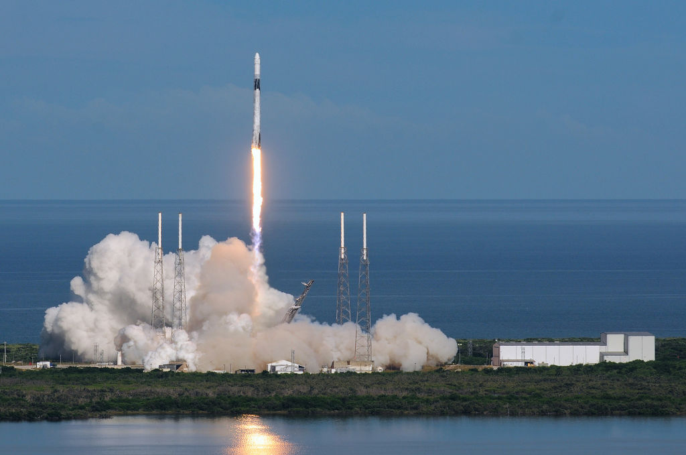

# Overview

This is the day 99 assignment.

## _From the course:_
90 minutes to complete

1,432 student solutions

Use space mission data from 1957 onwards to analyse and visualise trends over time.

You've learnt about all the core aspects of data exploration, data cleaning, and data visualisation. Download, unzip and open the notebook I've included for this assignment.

You'll find an incredibly rich dataset from nextspaceflight.com that includes all the space missions since the beginning of Space Race between the USA and the Soviet Union in 1957! It has data on the mission status (success/failure), the cost of the mission, the number of launches per country, and much much more. There's so much we can learn from this dataset about the dominant organisations and the trends over time. For example:

- Who launched the most missions in any given year?
- How has the cost of a space mission varied over time?
- Which months are the most popular for launches?
- Have space missions gotten safer or has the chance of failure remained unchanged?

I'm sure that you'll discover many more questions that you can formulate and answer with this dataset! Use it to practice what you learnt about creating various types of charts and visualisations, from choropleths to sunburst charts to segmented bar charts and see if you can turn data into insight. Good luck!




## My comments:


# Running

# External Links

# requirements.txt

```
pip install iso3166
```


# TODOs
